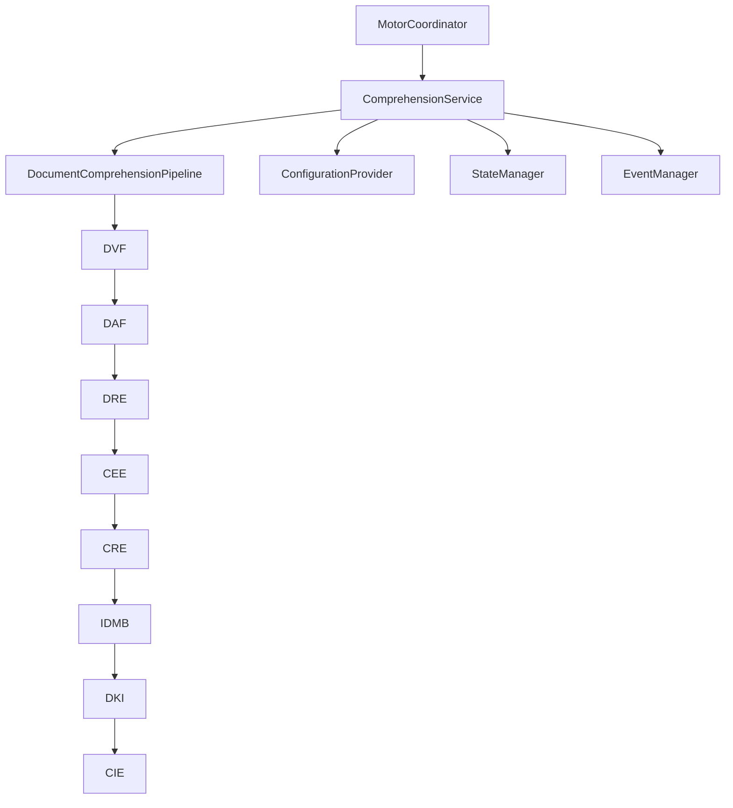

# Módulo de Comprensión Documental — Arquitectura Definitiva

**Implementación 2.10 — Prompt Maestro 4 CERTIFICADO**

## Responsabilidad del módulo

El Módulo de Comprensión Documental es el **único responsable** de transformar documentos del Centro de Evidencias en información estructurada, trazable e inmutable para los módulos posteriores del Motor Inteligente.

## Flujo oficial del Pipeline

```
PREPARACION(1) → VALIDACION(2) → ADAPTACION(3) → IDENTIFICACION(4)
→ EXTRACCION(5) → NORMALIZACION(6) → MODELADO(7) → INDEXACION(8)
→ INTEGRACION_CONTEXTO(9) → FINALIZACION(10)
```

| Etapa | Componente | Motor |
|-------|------------|-------|
| 2 | `document_validator` | Document Validation Framework |
| 3 | `document_adapters` | Document Adapter Framework |
| 4 | `format_identifier` | Document Recognition Engine |
| 5 | `extractors` | Content Extraction Engine |
| 6 | `normalizer` | Canonical Representation Engine |
| 7 | `internal_model_builder` | Internal Document Model Builder |
| 8 | `document_index` | Document Knowledge Index |
| 9 | `context_manager` | Context Integration Engine |

## Estructura del proyecto

```
comprehension/
├── service.py                 # ComprehensionService — fachada del módulo
├── port.py                    # ComprehensionPort — contrato público
├── registry.py                # ComponentRegistry
├── pipeline.py                # DocumentComprehensionPipeline
├── integration.py             # ComprehensionMotorIntegration
├── CERTIFICATION.md           # Certificación integral (2.10)
├── adapters/                  # DAF (2.2)
├── validation/                # DVF (2.3)
├── recognition/               # DRE (2.4)
├── extraction/                # CEE (2.5)
├── canonical/                 # CRE (2.6)
├── internal_model/            # IDMB (2.7)
├── knowledge_index/           # DKI (2.8)
├── context_integration/       # CIE (2.9)
└── components/                # Envoltorios de integración
```

## Contratos internos

| Contrato | Ubicación | Descripción |
|----------|-----------|-------------|
| `ComprehensionPort` | `port.py` | API pública del módulo |
| `ComprehensionComponentPort` | `components/base.py` | Contrato de componentes internos |
| `DocumentAdapterPort` | `adapters/port.py` | Adaptadores documentales |
| `ValidationRulePort` | `validation/port.py` | Reglas de validación |
| `RecognitionStrategyPort` | `recognition/port.py` | Estrategias de reconocimiento |
| `ContentExtractorPort` | `extraction/port.py` | Extractores de contenido |
| `CanonicalSectionTransformerPort` | `canonical/port.py` | Transformadores canónicos |
| `InternalEntityBuilderPort` | `internal_model/port.py` | Constructores del modelo interno |

## Dependencias permitidas

| Dependencia | Uso |
|-------------|-----|
| `ConfigurationProvider` | Configuración central |
| `StateManager` | Gestión de estados |
| `EventManager` | Gestión de eventos |
| `ModulePort` | Contrato base de módulos |
| Componentes internos | Arquitectura propia |

## Dependencias prohibidas

- Comunicación directa con otros módulos (`reception`, `documents`, `context`, `communication`)
- Librerías de OCR, PDF, Word, Excel, imágenes, IA o NLP
- Modificación del ERP (HTML, CSS, JavaScript)
- Configuraciones locales independientes
- Creación de estados oficiales nuevos

## Trazabilidad certificada

```
documento original
  → validación (dvf://)
  → adaptador (adapter://)
  → extracción (extraction://)
  → canónica (canonical://)
  → modelo interno (model://)
  → índice (dki://)
  → contexto (ctx://)
```

## Integración con el Motor Inteligente



1. `MotorCoordinator` registra y administra `ComprehensionService`
2. Toda comunicación entre módulos pasa por el Coordinator
3. El Pipeline documental ejecuta etapas secuencialmente
4. Estados y eventos se registran en cada etapa funcional

## Principios aplicados

- **Clean Architecture** — capas separadas
- **Arquitectura Hexagonal** — puertos y adaptadores
- **SOLID** — responsabilidad única por motor
- **Extensibilidad** — registros sin modificar el núcleo
- **Bajo acoplamiento** — sin dependencias cruzadas

## Certificación

Ver `CERTIFICATION.md` para criterios, pruebas y guía de desarrolladores.

```powershell
python certify_comprehension.py
python -m pytest tests/integration/test_comprehension_module_certification.py -v
```

## Estado del Prompt Maestro 4

**FINALIZADO** — Preparado para **Prompt Maestro 5: Módulo de Clasificación Inteligente**.
