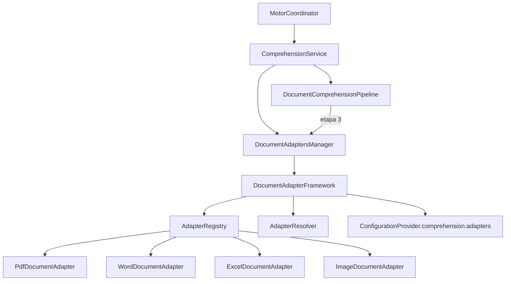

# Document Adapter Framework

**Implementación 2.2 — Prompt Maestro 4**

## Responsabilidad del Framework

El **Document Adapter Framework** es el único responsable de adaptar cualquier documento recibido hacia un flujo interno uniforme antes de su procesamiento. En esta etapa únicamente proporciona arquitectura extensible — sin lectura, OCR ni extracción.

## Responsabilidad de cada adaptador

| Adaptador | Formato | Responsabilidad futura |
|-----------|---------|------------------------|
| `PdfDocumentAdapter` | PDF (`.pdf`) | Adaptar documentos PDF al flujo interno |
| `WordDocumentAdapter` | Word (`.docx`, `.doc`) | Adaptar documentos Word al flujo interno |
| `ExcelDocumentAdapter` | Excel (`.xlsx`, `.xls`) | Adaptar hojas de cálculo al flujo interno |
| `ImageDocumentAdapter` | Imagen (`.png`, `.jpg`, etc.) | Adaptar imágenes documentales al flujo interno |

Cada adaptador implementa `DocumentAdapterPort` y tiene una única responsabilidad: representar su formato.

## Estructura

```
adapters/
├── port.py                 # DocumentAdapterPort — contrato común
├── registry.py             # AdapterRegistry — registro centralizado
├── resolver.py             # AdapterResolver — resolución por formato
├── framework.py            # DocumentAdapterFramework
├── models.py / enums.py
└── implementations/
    ├── pdf.py
    ├── word.py
    ├── excel.py
    └── image.py
```

## Flujo de integración



1. El `MotorCoordinator` administra `ComprehensionService`
2. `DocumentAdaptersManager` encapsula el Framework
3. `AdapterRegistry` registra todos los adaptadores desde un único punto
4. `AdapterResolver` selecciona el adaptador según `DocumentFormatType` (sin detección automática)
5. La configuración proviene de `DocumentAdapterSettings` en el sistema central
6. El `DocumentComprehensionPipeline` incluye la etapa `ADAPTACION` (orden 3)

## Reglas para incorporar nuevos formatos

1. Crear un nuevo adaptador en `implementations/` que implemente `DocumentAdapterPort`
2. Registrar el adaptador mediante `DocumentAdapterFramework.extend(adapter)`
3. Agregar el `DocumentFormatType` correspondiente en `enums.py`
4. Extender `DocumentAdapterSettings` con el flag de habilitación del formato
5. Actualizar `AdapterResolver._is_format_enabled()` con el nuevo mapeo

**No modificar:** Coordinator, Pipeline del núcleo, adaptadores existentes ni el Framework central.

## Dependencias prohibidas

- Librerías de PDF, Word, Excel, imágenes, OCR o IA
- Comunicación directa con otros módulos del Motor
- Configuraciones locales independientes del sistema central

## Próxima implementación

**2.3 — Validador Documental**: verificar integridad, compatibilidad y calidad inicial de documentos antes del flujo de comprensión.
