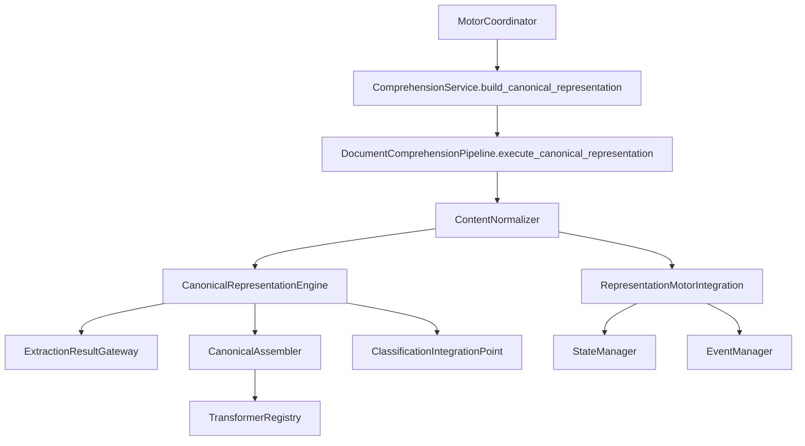

# Canonical Representation Engine (CRE)

**Implementación 2.6 — Prompt Maestro 4**

## Responsabilidad del CRE

El **Canonical Representation Engine (CRE)** es el único responsable de transformar la información estructural extraída en una **Representación Canónica uniforme**. No interpreta el contenido, no clasifica materiales ni aplica reglas de negocio.

## Modelo Canónico

Estructura uniforme e inmutable para cualquier documento:

```
Documento (CanonicalDocument)
├── Trazabilidad (CanonicalTraceability)
├── Proveedor (CanonicalProvider)
├── Información Comercial (CanonicalCommercialInformation)
├── Información Técnica (CanonicalTechnicalInformation)
├── Ítems (CanonicalItem[])
├── Condiciones (CanonicalCondition[])
├── Observaciones (CanonicalObservation[])
└── Metadatos (CanonicalMetadata)
```

## Transformadores de sección

| Transformador | Sección | Responsabilidad |
|---------------|---------|-----------------|
| `ProviderTransformer` | `provider` | Proveedor |
| `CommercialInformationTransformer` | `commercial_information` | Información comercial |
| `TechnicalInformationTransformer` | `technical_information` | Información técnica |
| `ItemsTransformer` | `items` | Ítems |
| `ConditionsTransformer` | `conditions` | Condiciones |
| `ObservationsTransformer` | `observations` | Observaciones |
| `MetadataTransformer` | `metadata` | Metadatos |

Todos implementan `CanonicalSectionTransformerPort`.

## Resultado uniforme

`CanonicalRepresentationResult` incluye:

- `representation` — `CanonicalDocument` inmutable
- `incidents` — incidencias durante la transformación
- `original_preserved` — documento original intacto
- `classification_integration_prepared` — preparación para PM5
- `transformers_executed` — transformadores ejecutados
- `technical_observations` — observaciones técnicas

## Estructura

```
canonical/
├── engine.py               # CanonicalRepresentationEngine
├── port.py                 # CanonicalSectionTransformerPort
├── registry.py             # TransformerRegistry
├── assembler.py            # CanonicalAssembler
├── gateway.py              # ExtractionResultGateway
├── classification_hook.py  # ClassificationIntegrationPoint
├── integration.py          # RepresentationMotorIntegration
├── models.py / enums.py
└── transformers/
    ├── provider.py
    ├── commercial.py
    ├── technical.py
    ├── items.py
    ├── conditions.py
    ├── observations.py
    └── metadata.py
```

## Flujo de integración



1. Validación (2) → Adaptación (3) → Reconocimiento (4) → Extracción (5) → **Normalización (6)**
2. El CRE recibe exclusivamente `ContentExtractionResult` del CEE
3. Nunca accede directamente al documento original
4. Cada elemento mantiene `source_reference` para trazabilidad

## Reglas de trazabilidad

`CanonicalTraceability` preserva:

- `document_id` — documento original
- `document_reference` — referencia del adaptador
- `extraction_reference_id` — enlace con CEE
- `original_preserved` — integridad del original
- `source_reference` en cada sección — enlace con contenido extraído

## Inmutabilidad

- Todos los modelos son `frozen=True`
- `CanonicalDocument.immutable = True` siempre
- Los módulos posteriores consumen sin alterar
- Cambios futuros requieren nueva representación

## Integración con CEE

`ExtractionResultGateway` valida:

- `process_id` coincidente
- `document_id` presente
- `adapter_name` presente
- `original_preserved = True`

## Preparación para Clasificación Inteligente (PM5)

`ClassificationIntegrationPoint` prepara la representación para consumo sin depender del documento original.

## Configuración central

`DocumentCanonicalSettings` en `config/categories/comprehension.py`.

## Siguiente etapa

**Implementación 2.7 — Internal Document Model Builder (IDMB):** construirá el Modelo Documental Interno definitivo para el Módulo de Clasificación Inteligente.
