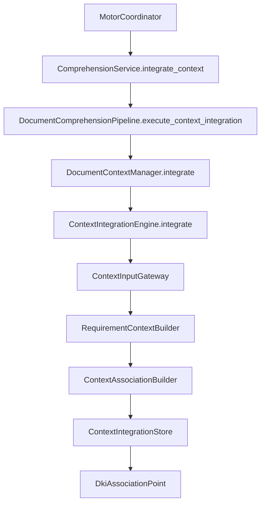

# Context Integration Engine (CIE)

**Implementación 2.9 — Prompt Maestro 4**

## Responsabilidad del CIE

El **Context Integration Engine (CIE)** es el único responsable de recibir, organizar, relacionar y preservar el contexto proveniente del campo **"Detalles del requerimiento"** del Centro de Evidencias, sin modificar la información documental.

No interpreta el contexto, no aplica reglas de negocio, no clasifica ni ejecuta razonamiento.

## Modelo de contexto

Estructura uniforme e inmutable para cualquier requerimiento:

```
RequirementContextModel
├── context_id          → identificador único (ctx://{process_id}/{document_id})
├── description         → contenido de 'Detalles del requerimiento'
├── observations        → observaciones (preparado, sin interpretación)
├── priorities          → prioridades (preparado, sin interpretación)
├── restrictions        → restricciones (preparado, sin interpretación)
├── additional_notes    → notas adicionales (preparado, sin interpretación)
├── metadata            → metadatos estructurales (source_field, content_length)
└── immutable           → inmutabilidad garantizada
```

## Reglas de asociación

| Regla | Descripción |
|-------|-------------|
| Fuente única | Solo `detalles_requerimiento` |
| Un contexto por documento/proceso | Sin duplicados |
| Separación documental | El contexto nunca modifica el modelo interno |
| Coherencia de IDs | `process_id`, `document_id`, `model_id`, `index_id` deben coincidir |

## Trazabilidad

```
ContextTraceability
├── documento original      → document_reference, original_preserved
├── representación canónica → canonical_reference_id
├── modelo interno          → model_id, model_reference
├── índice documental       → index_id, index_reference
└── contexto asociado       → context_id, document_unmodified
```

## Arquitectura interna

```
context_integration/
├── engine.py              # ContextIntegrationEngine — motor central
├── gateway.py             # ContextInputGateway — entrada exclusiva
├── context_builder.py     # RequirementContextBuilder — modelo uniforme
├── association_builder.py # ContextAssociationBuilder — vínculo contexto-documento
├── store.py               # ContextIntegrationStore — almacén en memoria
├── dki_hook.py            # DkiAssociationPoint — asociación con DKI
├── classification_hook.py # ClassificationContextPoint — PM5 preparado
├── reasoning_hook.py      # ReasoningContextPoint — PM7 preparado
├── integration.py         # ContextIntegrationMotorIntegration — estados/eventos
├── models.py              # RequirementContextModel, ContextAssociation
├── enums.py               # ContextIntegrationStatus
└── exceptions.py          # DuplicateContextAssociationError, etc.
```

## Integración con el Pipeline



Etapa oficial del Pipeline documental:

```
VALIDACION(2) → ADAPTACION(3) → IDENTIFICACION(4) → EXTRACCION(5)
→ NORMALIZACION(6) → MODELADO(7) → INDEXACION(8) → INTEGRACION_CONTEXTO(9) → FINALIZACION(10)
```

## Integración con el DKI

- El CIE recibe `DocumentIndexResult` como referencia de indexación
- `DkiAssociationPoint` registra la asociación `index_id` ↔ `context_id`
- **Nunca modifica** el contenido de `KnowledgeIndexStore`

## Integración con estados y eventos

| Momento | Estado | Evento |
|---------|--------|--------|
| Inicio integración | `PROCESANDO` | Integración de contexto iniciada |
| Integración completada | `PROCESAMIENTO_COMPLETADO` | Integración exitosa o con incidencias |

## Configuración centralizada

`DocumentContextIntegrationSettings` en `ConfigurationProvider.comprehension().context_integration`:

| Parámetro | Descripción |
|-----------|-------------|
| `enabled` | Activación futura del CIE |
| `preserve_document_immutability` | Garantía de no modificación documental |
| `dki_association_prepared` | Asociación con DKI preparada |
| `classification_integration_prepared` | Preparación para PM5 |
| `reasoning_integration_prepared` | Preparación para PM7 |
| `max_associations_in_memory` | Límite de asociaciones en memoria |

## Preparación para Prompts Maestros futuros

- **PM5 — Clasificación Inteligente:** `ClassificationContextPoint` conserva contexto sin interpretarlo
- **PM7 — Razonamiento:** `ReasoningContextPoint` prepara contexto como evidencia adicional

## Próxima implementación

**2.10 — Certificación integral del Módulo de Comprensión Documental (2.1–2.9).**
