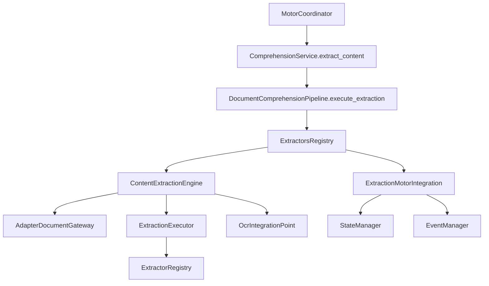

# Content Extraction Engine (CEE)

**Implementación 2.5 — Prompt Maestro 4**

## Responsabilidad del CEE

El **Content Extraction Engine (CEE)** es el único responsable de extraer la información estructural de los documentos que hayan superado las etapas anteriores del Pipeline. No interpreta el contenido, no comprende significado, no clasifica materiales ni ejecuta reglas de negocio.

## Extractores especializados

| Extractor | Tipo | Responsabilidad |
|-----------|------|-----------------|
| `TextExtractor` | `text` | Contenido textual |
| `TablesExtractor` | `tables` | Tablas detectadas |
| `MetadataExtractor` | `metadata` | Metadatos identificados |
| `HeadersExtractor` | `headers` | Encabezados |
| `FootersExtractor` | `footers` | Pies de página |
| `ListsExtractor` | `lists` | Listas |
| `EmbeddedImagesExtractor` | `embedded_images` | Imágenes embebidas |
| `StructuralElementsExtractor` | `structural_elements` | Anexos y elementos estructurales |

Todos implementan `ContentExtractorPort` con contrato uniforme.

## Resultado uniforme

`ContentExtractionResult` incluye:

- `extracted_text` — contenido textual consolidado
- `tables` — tablas detectadas
- `metadata` — metadatos identificados
- `structural_elements` — elementos estructurales encontrados
- `incidents` — incidencias durante la extracción
- `original_preserved` — documento original intacto
- `ocr_integration_prepared` — preparación para OCR futuro
- `adapter_name` — adaptador documental utilizado
- `technical_observations` — observaciones técnicas

## Estructura

```
extraction/
├── engine.py               # ContentExtractionEngine
├── port.py                 # ContentExtractorPort
├── registry.py             # ExtractorRegistry
├── executor.py             # ExtractionExecutor
├── adapter_gateway.py      # AdapterDocumentGateway
├── ocr_hook.py             # OcrIntegrationPoint
├── integration.py          # ExtractionMotorIntegration
├── models.py / enums.py
└── extractors/
    ├── text.py
    ├── tables.py
    ├── metadata.py
    ├── headers.py
    ├── footers.py
    ├── lists.py
    ├── embedded_images.py
    └── structural_elements.py
```

## Flujo de integración



1. Validación (2) → Adaptación (3) → Reconocimiento (4) → **Extracción (5)**
2. El CEE recibe el documento exclusivamente vía `AdapterDocumentContext`
3. Ningún extractor accede directamente al archivo original
4. El Coordinator controla el flujo — los extractores no se comunican con otros módulos

## Integración con adaptadores documentales

`AdapterDocumentGateway` valida que:

- El documento provenga de un adaptador registrado
- Exista referencia del adaptador (`document_reference`)
- El documento original esté preservado (`original_preserved=True`)

## Preparación para OCR

`OcrIntegrationPoint` expone el punto de integración futuro:

- `is_prepared` — arquitectura lista
- `is_enabled` — controlado por configuración central
- `can_execute()` — `False` en esta etapa (sin ejecución)
- `prepare_for_future_execution()` — registro sin procesamiento

## Configuración central

`DocumentExtractionSettings` en `config/categories/comprehension.py`:

- Activación por extractor
- `preserve_original`
- `ocr_integration_prepared` / `ocr_enabled`

## Extensibilidad

Nuevos extractores se incorporan mediante `ContentExtractionEngine.extend()` sin modificar el núcleo del motor.

## Siguiente etapa

**Implementación 2.6 — Canonical Representation Engine (CRE):** transformará la información extraída en Representación Canónica uniforme para Clasificación Inteligente.
