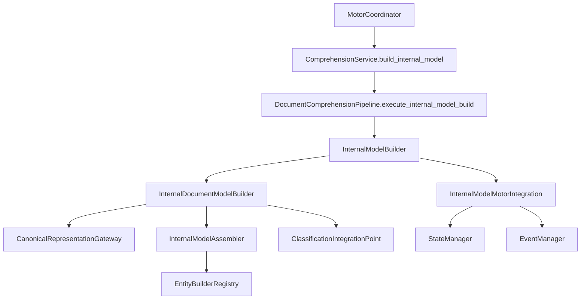

# Internal Document Model Builder (IDMB)

**Implementación 2.7 — Prompt Maestro 4**

## Responsabilidad del IDMB

El **Internal Document Model Builder (IDMB)** es el único responsable de construir el Modelo Documental Interno definitivo a partir de la Representación Canónica. No interpreta semánticamente, no clasifica materiales ni aplica reglas de negocio.

## Modelo Documental Interno

Estructura uniforme e inmutable para cualquier documento:

```
InternalDocumentModel
├── traceability              → documento → extracción → canónica → modelo
├── document                  → entidad Documento
├── provider                  → entidad Proveedor
├── commercial_information    → Información Comercial
├── technical_information     → Información Técnica
├── items[]                   → Ítems
├── commercial_conditions[]   → Condiciones Comerciales
├── observations[]            → Observaciones
├── metadata                  → Metadatos
├── requirement_context       → Contexto del Requerimiento
└── original_references       → Referencias al Documento Original
```

## Constructores de entidad

| Constructor | Entidad | Responsabilidad |
|-------------|---------|-----------------|
| `DocumentEntityBuilder` | `document` | Entidad Documento |
| `ProviderEntityBuilder` | `provider` | Proveedor |
| `CommercialInformationEntityBuilder` | `commercial_information` | Información comercial |
| `TechnicalInformationEntityBuilder` | `technical_information` | Información técnica |
| `ItemsEntityBuilder` | `items` | Ítems |
| `CommercialConditionsEntityBuilder` | `commercial_conditions` | Condiciones comerciales |
| `ObservationsEntityBuilder` | `observations` | Observaciones |
| `MetadataEntityBuilder` | `metadata` | Metadatos |
| `RequirementContextEntityBuilder` | `requirement_context` | Contexto del requerimiento |
| `OriginalReferencesEntityBuilder` | `original_references` | Referencias al original |

Todos implementan `InternalEntityBuilderPort`.

## Relaciones del modelo

- Cada entidad referencia `document_id` para navegación coherente
- `canonical_reference` y `extraction_reference` en cada entidad
- Sin duplicación de información estructural
- `InternalTraceability` centraliza la cadena completa

## Reglas de trazabilidad

Cada entidad mantiene:

- `canonical_reference` — enlace con la Representación Canónica
- `extraction_reference` — enlace con el contenido extraído (CEE)
- `source_reference` — posición en el modelo interno
- `original_references` — referencia directa al documento original

## Estructura

```
internal_model/
├── engine.py               # InternalDocumentModelBuilder
├── port.py                 # InternalEntityBuilderPort
├── registry.py             # EntityBuilderRegistry
├── assembler.py            # InternalModelAssembler
├── gateway.py              # CanonicalRepresentationGateway
├── classification_hook.py  # ClassificationIntegrationPoint
├── integration.py          # InternalModelMotorIntegration
├── models.py / enums.py
└── builders/
    ├── document.py
    ├── provider.py
    ├── commercial.py
    ├── technical.py
    ├── items.py
    ├── conditions.py
    ├── observations.py
    ├── metadata.py
    ├── requirement_context.py
    └── original_references.py
```

## Flujo de integración



1. Validación (2) → ... → Normalización (6) → **Modelado Interno (7)**
2. El IDMB recibe exclusivamente `CanonicalRepresentationResult` del CRE
3. Nunca accede directamente al documento original
4. El modelo resultante es inmutable y de solo lectura

## Inmutabilidad

- Todos los modelos son `frozen=True`
- `InternalDocumentModel.immutable = True` siempre
- Los módulos posteriores (PM5) consumen sin alterar
- Nueva versión requiere nuevo modelo

## Preparación para Prompt Maestro 5

`ClassificationIntegrationPoint` prepara el modelo para consumo directo por Clasificación Inteligente, sin depender del documento original ni de la Representación Canónica.

## Configuración central

`DocumentInternalModelSettings` en `config/categories/comprehension.py`.

## Siguiente etapa

**Prompt Maestro 5 — Módulo de Clasificación Inteligente:** identificará materiales, servicios, conceptos equivalentes y grupos comparables utilizando este Modelo Documental Interno como única fuente de información.
