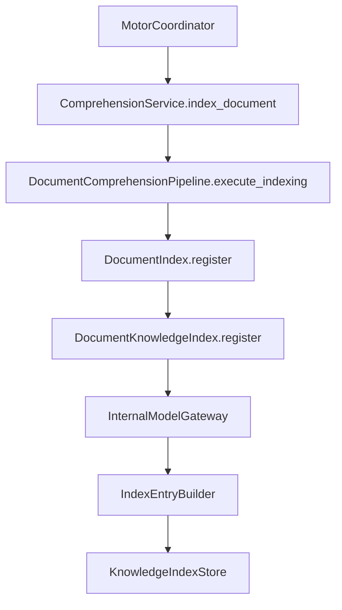

# Document Knowledge Index (DKI)

**Implementación 2.8 — Prompt Maestro 4**

## Responsabilidad del DKI

El **Document Knowledge Index (DKI)** es el único responsable de organizar internamente los Modelos Documentales Internos generados por el IDMB para que puedan localizarse, reutilizarse y mantenerse trazables durante todo el ciclo de vida del Motor Inteligente.

No implementa motores de búsqueda, almacenamiento persistente, clasificación ni reglas de negocio.

## Estructura del índice

```
DocumentIndexEntry
├── index_id                    → identificador único (dki://{model_id})
├── traceability                → cadena completa de trazabilidad
├── status                      → estado de la entrada (REGISTERED)
├── provider_name               → proveedor documental
├── requirement_code            → código del requerimiento
├── project_id                  → proyecto asociado
├── model_reference             → referencia al modelo interno
├── query_keys                  → claves preparadas para consultas futuras
├── reuse_prepared              → preparación para reutilización
└── query_integration_prepared  → preparación para motor de consultas
```

## Índice de trazabilidad

Cada entrada mantiene la relación con:

| Relación | Campo |
|----------|-------|
| Documento original | `document_reference`, `original_preserved` |
| Resultado de validación | `validation_reference` |
| Adaptador documental | `adapter_name` |
| Representación canónica | `canonical_reference_id` |
| Modelo documental interno | `model_id`, `model_reference` |

## Arquitectura interna

```
knowledge_index/
├── engine.py            # DocumentKnowledgeIndex — motor central
├── gateway.py           # InternalModelGateway — entrada exclusiva desde IDMB
├── entry_builder.py     # IndexEntryBuilder — entradas uniformes
├── store.py             # KnowledgeIndexStore — almacén en memoria
├── query_hook.py        # QueryIntegrationPoint — consultas futuras
├── reuse_hook.py        # ReuseIntegrationPoint — reutilización futura
├── integration.py       # KnowledgeIndexMotorIntegration — estados y eventos
├── models.py            # DocumentIndexEntry, DocumentIndexTraceability
├── enums.py             # IndexEntryStatus, IndexingIncidentSeverity
└── exceptions.py        # DuplicateIndexEntryError, InternalModelInputError
```

## Integración con el Pipeline



Etapa oficial del Pipeline documental:

```
VALIDACION(2) → ADAPTACION(3) → IDENTIFICACION(4) → EXTRACCION(5)
→ NORMALIZACION(6) → MODELADO(7) → INDEXACION(8) → FINALIZACION(9)
```

## Integración con el IDMB

- El DKI recibe exclusivamente `InternalModelBuildResult` vía `DocumentIndexRequest`
- `InternalModelGateway` valida inmutabilidad, trazabilidad y coherencia del `process_id`
- Nunca accede directamente al documento original

## Integración con estados y eventos

| Momento | Estado | Evento |
|---------|--------|--------|
| Inicio indexación | `PROCESANDO` | Indexación documental iniciada |
| Indexación completada | `PROCESAMIENTO_COMPLETADO` | Indexación exitosa o con incidencias |

## Configuración centralizada

`DocumentKnowledgeIndexSettings` en `ConfigurationProvider.comprehension().knowledge_index`:

| Parámetro | Descripción |
|-----------|-------------|
| `enabled` | Activación futura del índice |
| `prevent_duplicates` | Prevención de registros duplicados |
| `query_integration_prepared` | Preparación para consultas |
| `reuse_integration_prepared` | Preparación para reutilización |
| `max_entries_in_memory` | Límite de entradas en memoria |

## Preparación para crecimiento

- `QueryIntegrationPoint`: criterios `document_id`, `provider_name`, `project_id`, `requirement_code`, `model_id`
- `ReuseIntegrationPoint`: localización de modelos existentes sin reprocesamiento
- `KnowledgeIndexStore`: almacén en memoria extensible a persistencia futura sin refactorizar el núcleo

## Próxima implementación

**2.10 — Certificación integral del Módulo de Comprensión Documental (2.1–2.9).**
