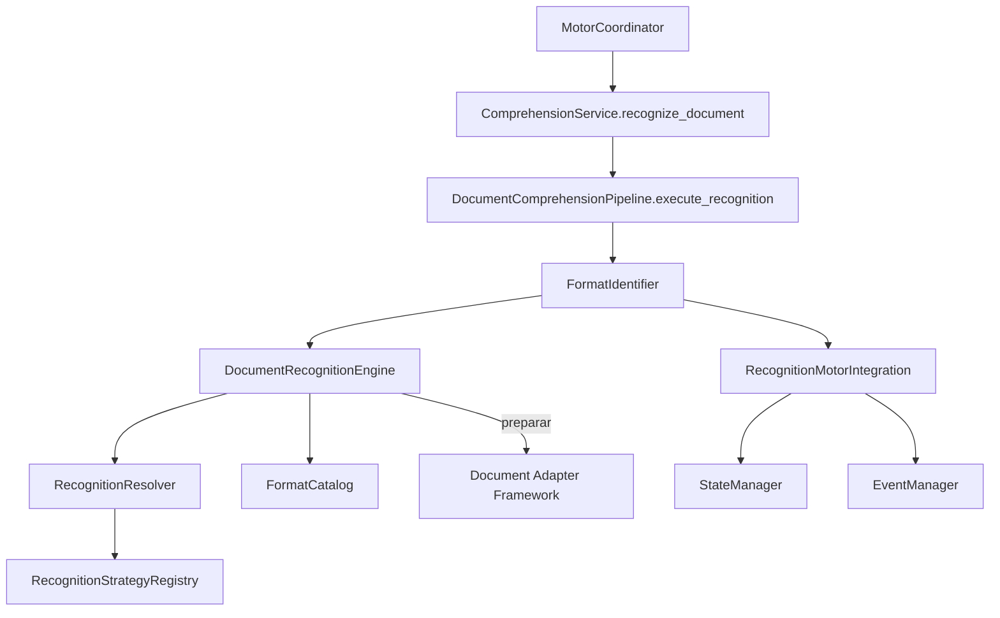

# Document Recognition Engine (DRE)

**Implementación 2.4 — Prompt Maestro 4**

## Responsabilidad del DRE

El **Document Recognition Engine (DRE)** es el único responsable de identificar el tipo de documento recibido y determinar qué adaptador documental deberá utilizar el Pipeline. No lee contenido, no ejecuta OCR ni toma decisiones de negocio.

## Estrategias de reconocimiento

| Estrategia | Fuente | Estado |
|------------|--------|--------|
| `ExtensionRecognitionStrategy` | Extensión del archivo | Activa por defecto |
| `MimeTypeRecognitionStrategy` | Tipo MIME en metadatos | Activa por defecto |
| `MetadataRecognitionStrategy` | Metadatos explícitos | Activa por defecto |
| `MagicNumberRecognitionStrategy` | Firma en metadatos | Preparada (desactivada por defecto) |

Todas implementan `RecognitionStrategyPort`.

## Catálogo de formatos

`FormatCatalog` mapea formatos a adaptadores:

| Formato | Adaptador sugerido |
|---------|-------------------|
| PDF | `pdf_adapter` |
| Word (`docx`) | `word_adapter` |
| Excel (`xlsx`) | `excel_adapter` |
| Imagen | `image_adapter` |

Extensible para nuevos formatos sin modificar el núcleo.

## Resultado uniforme

`DocumentRecognitionResult` incluye:

- `identified_format` — tipo documental identificado
- `confidence` / `confidence_level` — nivel de confianza
- `strategy_used` / `strategy_type` — estrategia utilizada
- `suggested_adapter` — adaptador sugerido
- `adapter_selection` — preparación de integración con DAF
- `technical_observations` — observaciones técnicas

## Estructura

```
recognition/
├── engine.py               # DocumentRecognitionEngine
├── port.py                 # RecognitionStrategyPort
├── registry.py             # RecognitionStrategyRegistry
├── resolver.py             # RecognitionResolver
├── catalog.py              # FormatCatalog
├── integration.py          # RecognitionMotorIntegration
├── models.py / enums.py
└── strategies/
    ├── extension.py
    ├── mime_type.py
    ├── metadata.py
    └── magic_number.py
```

## Flujo de integración



1. Validación (etapa 2) → Adaptación preparada (etapa 3) → **Reconocimiento (etapa 4)**
2. El DRE ejecuta estrategias y selecciona la de mayor confianza
3. `prepare_adapter_selection()` prepara el adaptador sin ejecutarlo
4. Estados: `PREPARANDO_PROCESAMIENTO` / `INFORMACION_RECIBIDA`
5. Eventos: categoría `DOCUMENT`

## Reglas para incorporar nuevos formatos

1. Agregar entrada en `FormatCatalog` (extensiones, MIME, magic, adaptador)
2. Opcionalmente extender `DocumentFormatType` en adapters
3. Actualizar `DocumentRecognitionSettings.supported_formats`

## Reglas para incorporar nuevas estrategias

1. Crear estrategia en `strategies/` implementando `RecognitionStrategyPort`
2. Registrar mediante `DocumentRecognitionEngine.extend(strategy)`
3. Agregar flag de habilitación en `DocumentRecognitionSettings` si aplica

**No modificar:** Coordinator, Pipeline del núcleo, estrategias existentes.

## Próxima implementación

**2.5 — Content Extraction Engine (CEE)**: extracción estructural de contenido documental.
