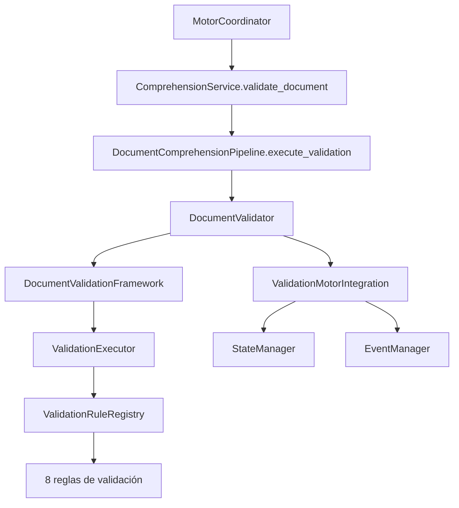

# Document Validation Framework (DVF)

**Implementación 2.3 — Prompt Maestro 4**

## Responsabilidad del Framework

El **Document Validation Framework (DVF)** es el único responsable de validar todos los documentos antes de que ingresen al proceso de comprensión documental. Evalúa si un documento está preparado para continuar en el Pipeline y registra el resultado de dicha evaluación.

## Responsabilidad de cada regla

| Regla | Incidencia | Responsabilidad futura |
|-------|------------|----------------------|
| `EmptyFileRule` | `empty_file` | Detectar archivos vacíos |
| `CorruptFileRule` | `corrupt_file` | Detectar archivos corruptos |
| `UnsupportedFormatRule` | `unsupported_format` | Detectar formatos no soportados |
| `InaccessibleFileRule` | `inaccessible_file` | Detectar archivos inaccesibles |
| `IncompleteDocumentRule` | `incomplete_document` | Detectar documentos incompletos |
| `IllegibleDocumentRule` | `illegible_document` | Detectar documentos ilegibles |
| `InvalidSizeRule` | `invalid_size` | Detectar tamaños inválidos |
| `InconsistentStructureRule` | `inconsistent_structure` | Detectar estructuras inconsistentes |

Cada regla implementa `ValidationRulePort` y es independiente y reutilizable.

## Estructura

```
validation/
├── port.py                 # ValidationRulePort — contrato común
├── registry.py             # ValidationRuleRegistry — registro centralizado
├── executor.py             # ValidationExecutor — consolida resultados
├── framework.py            # DocumentValidationFramework
├── integration.py          # ValidationMotorIntegration (estados/eventos)
├── models.py / enums.py
└── rules/
    ├── empty_file.py
    ├── corrupt_file.py
    ├── unsupported_format.py
    ├── inaccessible_file.py
    ├── incomplete_document.py
    ├── illegible_document.py
    ├── invalid_size.py
    └── inconsistent_structure.py
```

## Resultado uniforme

Cada documento genera un `DocumentValidationResult` con:

- `status` — `passed`, `warning` o `failed`
- `incidents` — lista de incidencias detectadas
- `warnings` — advertencias
- `quality_level` — nivel preliminar (`low`, `acceptable`, `high`)
- `technical_observations` — observaciones técnicas
- `rules_executed` / `rules_passed`

## Flujo de validación



1. El **Coordinator** inicia la validación invocando `ComprehensionService`
2. El **Pipeline documental** ejecuta la etapa `VALIDACION` (orden 2) antes de adaptación
3. El **DVF** ejecuta todas las reglas registradas
4. El resultado se consolida en estructura uniforme
5. **StateManager** actualiza estados oficiales (`VALIDANDO_INFORMACION`, `INFORMACION_RECIBIDA`, `ERROR_VALIDACION`)
6. **EventManager** registra eventos de categoría `VALIDATION`

## Integración con el Coordinator

- El Coordinator es el único orquestador externo
- `ComprehensionService.validate_document()` es el punto de entrada
- Las reglas individuales no comunican con otros módulos

## Reglas para incorporar nuevas validaciones

1. Crear regla en `rules/` implementando `ValidationRulePort`
2. Registrar mediante `DocumentValidationFramework.extend(rule)`
3. Agregar `ValidationIncidentType` si aplica
4. Extender `DocumentValidationSettings` si requiere configuración

**No modificar:** Framework central, Coordinator, Pipeline ni reglas existentes.

## Próxima implementación

**2.4 — Sistema Inteligente de Identificación de Formato**: reconocimiento automático del tipo de documento y selección del adaptador adecuado.
